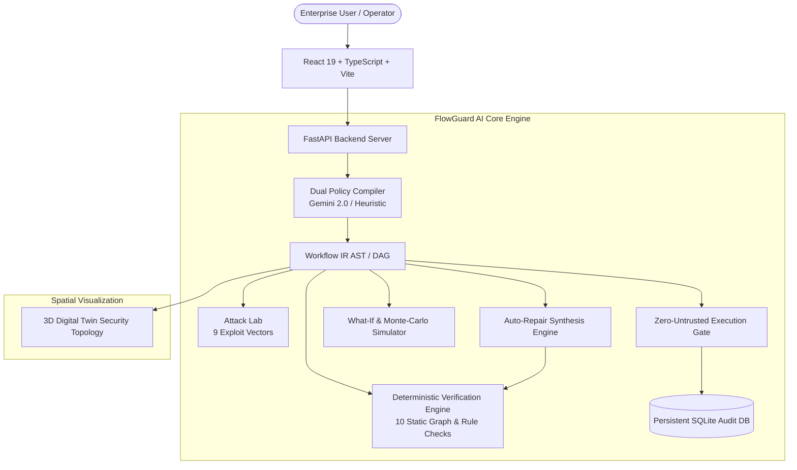

# FlowGuard AI — Natural Language to Verified Workflow Compiler

> **AI workflow security platform that verifies, attacks, repairs, and safely executes agentic workflows before they reach production.**

[](https://www.typescriptlang.org/)
[](https://www.python.org/)
[](https://fastapi.tiangolo.com/)
[](https://react.dev/)
[](https://opensource.org/licenses/MIT)

---

## 1. Problem Statement

As enterprises deploy autonomous AI agents to execute consequential operational workflows (e.g. procurement, funds disbursement, infrastructure changes, customer refunds), major vulnerabilities emerge:
- **Approval Bypasses**: Agents finding alternate execution shortcuts that circumvent mandatory human authorizations.
- **Privilege Escalation**: Non-privileged actors triggering high-risk payment or administrative actions.
- **Circular Deadlocks & State Violations**: Undetected cycles causing infinite execution loops and state corruption.
- **Fail-Open Crashes**: Missing error fallbacks leading to silent failures and unrecoverable states.

Traditional workflow engines discover these failures **at runtime after damage has occurred**. Developers and security teams lack a mathematical, pre-execution verification layer to guarantee safety.

---

## 2. Solution Overview

**FlowGuard AI** (CF26-P03) is a defense-in-depth workflow security compiler and zero-untrusted execution gate. It translates natural-language policies into a strongly-typed **Intermediate Representation (Workflow IR)** and subjects them to deterministic static verification, adversarial penetration testing, auto-repair synthesis, and gated runtime execution.

```
┌─────────────────────────────────────────────────────────────────────────────────────────────────┐
│                                 FLOWGUARD AI COMPILATION PIPELINE                               │
└─────────────────────────────────────────────────────────────────────────────────────────────────┘
  POLICY TEXT           AST / IR GRAPH           STATIC VERIFICATION          RUNTIME GATEWAY
 ┌───────────┐         ┌───────────────┐        ┌───────────────────┐        ┌────────────────┐
 │ Natural   │ ──────► │ Nodes, Edges, │ ─────► │ 10 Deterministic  │ ─────► │ Zero-Untrusted │
 │ Business  │         │ Preconditions │        │ Graph Algorithms  │        │ State Machine  │
 │ Policy    │         │ Actor Scopes  │        │ (100% Deterministic)       │ Safe Execution │
 └───────────┘         └───────────────┘        └───────────────────┘        └────────────────┘
                               ▲                          │ (Vulnerable)             │
                               │                          ▼                          ▼
                               │                 ┌──────────────────┐        ┌────────────────┐
                               └──────────────── │ 9 Attack Vectors │        │ Immutable      │
                                 Auto-Repair     │ Auto-Repair AST  │        │ SQLite Audit   │
                                 Synthesis       └──────────────────┘        └────────────────┘
```

---

## 3. Key Capabilities & Feature Matrix

- **Dual-Engine Policy Compiler**: Compiles unstructured text into strongly-typed DAG IR via Google Gemini 2.0 or local offline heuristic parsing.
- **Deterministic Static Verification Engine**: 10 mathematical graph and rule checks (Cycles, Reachability, Approval Bypass, RBAC, Ordering, FSM Invariants, Dead Ends, Dependency Satisfaction, Failure Path Completeness, Ambiguity).
- **Security Attack Lab**: 9 adversarial penetration scenarios with glowing real-time attack path isolation.
- **Auto-Repair Studio**: Visual Before/After diffs with automated edge rewiring, gate insertion, and formal re-verification proofs.
- **3D Security Digital Twin**: Spatial topological operations command center with physical anchor connections, simulated telemetry, and live execution particle streams.
- **What-If Outage Simulator**: Simulates arbitrary node outages, rejections, and timeouts to evaluate primary vs. recovery paths.
- **Monte-Carlo Stress Testing**: Simulates 1,000–10,000 randomized execution scenarios to compute MTBF and reliability percentiles.
- **Zero-Untrusted Runtime Gateway**: Workflows evaluated as `BLOCKED` are strictly halted; verified workflows execute with live step-by-step state machine telemetry.

---

## 4. System Architecture



For complete architectural details, see [docs/architecture.md](docs/architecture.md).

---

## 5. Technology Stack

### Frontend
- **Framework**: React 19, TypeScript 5.x, Vite 8.x
- **UI & Components**: Radix UI, Lucide React, Sonner, TailwindCSS 4
- **Graph & 3D Visualization**: React Flow (`@xyflow/react`), Three.js / React Three Fiber, Framer Motion
- **State Management**: Zustand 5

### Backend
- **Framework**: Python 3.11+, FastAPI, Uvicorn, Pydantic v2
- **Graph Algorithms**: NetworkX (Tarjan SCC, DFS cycle detection, DAG longest paths)
- **Database**: SQLite with SQLAlchemy ORM
- **Testing**: Pytest, Pytest-Asyncio, Pytest-Cov

---

## 6. Setup & Installation

### Prerequisites
- **Node.js**: `>= 18.0.0`
- **Python**: `>= 3.11.0`
- **Git**

### 1. Clone the Repository
```bash
git clone https://github.com/sarthakwalokar/CF26-P03-Team-Rudra.git
cd CF26-P03-Team-Rudra
```

### 2. Backend Setup
```bash
cd backend
python -m venv venv

# On Windows:
venv\Scripts\activate
# On Linux/macOS:
# source venv/bin/activate

pip install -r requirements.txt
python -m uvicorn main:app --host 127.0.0.1 --port 8000 --reload
```
The backend will be available at `http://127.0.0.1:8000`. API docs available at `http://127.0.0.1:8000/docs`.

### 3. Frontend Setup
```bash
# In a new terminal:
cd frontend
npm install
npm run dev
```
The frontend will start at `http://localhost:5173`.

### 4. Environment Configuration
Copy `.env.example` to `.env`:
```bash
cp .env.example .env
```
*(Optional: Provide `GEMINI_API_KEY` for LLM-driven parsing, or use the built-in offline parser with zero configuration).*

---

## 7. Automated Test Suite & Validation

Run all unit and regression tests:

```bash
# In backend directory with venv activated:
pytest app/tests/ -v
```

### Test Results
```
============================= test session starts =============================
platform win32 -- Python 3.13.7, pytest-8.3.3, pluggy-1.6.0
rootdir: D:\FLOWGUARD AI
collected 8 items

backend/app/tests/test_attack.py::test_attack_approval_bypass PASSED     [ 12%]
backend/app/tests/test_attack.py::test_attack_unauthorized_actor PASSED  [ 25%]
backend/app/tests/test_attack.py::test_attack_suite_comprehensive PASSED [ 37%]
backend/app/tests/test_repair.py::test_auto_repair_generation PASSED     [ 50%]
backend/app/tests/test_verification.py::test_valid_workflow_verification PASSED [ 62%]
backend/app/tests/test_verification.py::test_unreachable_node_detection PASSED [ 75%]
backend/app/tests/test_verification.py::test_circular_dependency_detection PASSED [ 87%]
backend/app/tests/test_verification.py::test_missing_approval_bypass_detection PASSED [100%]

======================= 8 passed, 32 warnings in 0.77s ========================
```

---

## 8. Hackathon 3-Minute Demo Flow

1. **Compile**: Go to `/`, select **Procurement Approval** preset, and click **"Compile Policy to IR"**.
2. **Verify**: Navigate to `/verify`, run verification, and view the **10 Deterministic Checks** and multidimensional score breakdown.
3. **Attack**: Go to `/attack`, run the **Approval Bypass** scenario, and see the exploit path illuminated in ruby red.
4. **Auto-Repair**: Go to `/repair`, click **"Generate Auto-Repair"**, inspect the side-by-side AST diff, and apply the re-verified patch ($34 \rightarrow 98$).
5. **3D Twin & Execution**: Go to `/3d` to inspect the 3D topology, then go to `/execute` to run the gated workflow with live state machine telemetry.

For detailed instructions, see [docs/demo.md](docs/demo.md).

---

## 9. Engineering Limitations & Disclosures

- **Static Rule Boundaries**: Verification checks cover implemented graph invariants, RBAC conditions, and state transitions; it does not claim full general theorem proving.
- **Simulated Telemetry**: Telemetry streaming in the 3D Twin is labeled as simulated benchmarking data.
- **Execution Sandboxing**: Runtime execution demonstrates state machine progression and zero-untrusted gating; it does not execute live financial transactions.

---

## 10. Future Scope

- **Formal SMT / Z3 Integration**: SMT solver integration for deep arithmetic predicate verification.
- **OpenTelemetry Production Bridges**: Ingesting live distributed traces from production LangGraph / Temporal clusters.
- **Multi-Tenant RBAC Workspaces**: Enterprise role-based access control and persistent multi-user workspaces.

---

## 11. Team Information & AI Assistance Disclosure

### Team Rudra (CF26-P03)
- **Problem Statement**: P-03 — Natural Language to Verified Workflow Compiler

### AI Assistance Disclosure
AI coding assistants were utilized during development for code exploration, algorithmic drafting, documentation assistance, and UI refactoring. All architecture, graph verification logic, attack simulations, integration testing, and final engineering deliverables were reviewed and validated by the team.

---

## 12. License

This project is licensed under the MIT License — see the [LICENSE](LICENSE) file for details.
