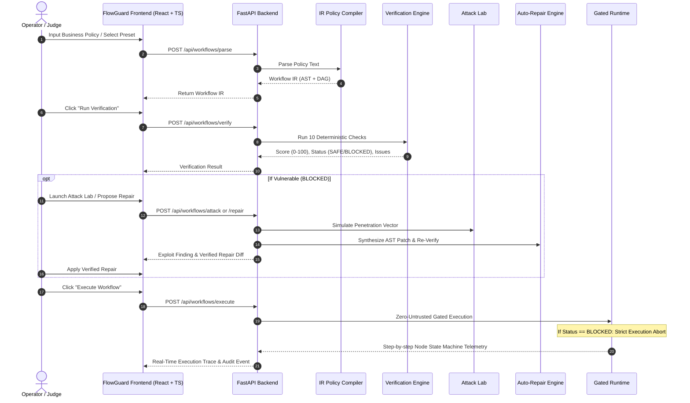

# FlowGuard AI — System Architecture & Technical Specification

> **CF26-P03: Natural Language to Verified Workflow Compiler**  
> **Team Rudra**

---

## 1. Executive Architectural Overview

**FlowGuard AI** is a defense-in-depth AI workflow compiler, static verification engine, and zero-untrusted execution gate. Rather than allowing unvalidated Large Language Model (LLM) agents to execute consequential enterprise actions directly, FlowGuard compiles natural-language operational policies into a **strongly-typed Intermediate Representation (IR)** and subjects them to deterministic static verification, adversarial penetration testing (Attack Lab), auto-repair synthesis, what-if outage modeling, and 10,000-scenario Monte-Carlo stress testing.

```
┌────────────────────────────────────────────────────────────────────────────────────────┐
│                                FLOWGUARD AI COMPILER PIPELINE                          │
└────────────────────────────────────────────────────────────────────────────────────────┘
                                         │
 1. POLICY INGESTION                     ▼
 ┌───────────────────────────────────────────────────────────────────────────────────────┐
 │ "All procurement requests above $10,000 require VP Finance approval before PO..."    │
 └───────────────────────────────────────────────────────────────────────────────────────┘
                                         │
 2. IR COMPILATION                       ▼
 ┌───────────────────────────────────────────────────────────────────────────────────────┐
 │ AST Synthesis · Actor Scoping · Pre/Postconditions · Node Graph · Failure Policies     │
 └───────────────────────────────────────────────────────────────────────────────────────┘
                                         │
 3. DETERMINISTIC STATIC VERIFICATION    ▼
 ┌───────────────────────────────────────────────────────────────────────────────────────┐
 │ 10 Formal Graph & Semantic Checks (Cycles, Reachability, Bypass, RBAC, Ordering...)   │
 └───────────────────────────────────────────────────────────────────────────────────────┘
                                         │
 4. ADVERSARIAL ATTACK SIMULATION        ▼
 ┌───────────────────────────────────────────────────────────────────────────────────────┐
 │ 9 Security Exploit Scenarios (Approval Bypass, Role Escalation, Dependency Tampering) │
 └───────────────────────────────────────────────────────────────────────────────────────┘
                                         │
 5. AUTOMATED REPAIR SYNTHESIS           ▼
 ┌───────────────────────────────────────────────────────────────────────────────────────┐
 │ AST Transformation · Edge Rewiring · Approval Insertion · Re-Verification Proof       │
 └───────────────────────────────────────────────────────────────────────────────────────┘
                                         │
 6. ZERO-UNTRUSTED RUNTIME EXECUTION     ▼
 ┌───────────────────────────────────────────────────────────────────────────────────────┐
 │ Gated State Machine · Telemetry Streaming · Fail-Safe Execution · Immutable Audit Log │
 └───────────────────────────────────────────────────────────────────────────────────────┘
```

---

## 2. Component Decomposition

### 2.1 Policy Ingestion & IR Compiler (`backend/app/services/parser.py`)
- **Dual Mode Compiler**:
  - **LLM-Driven Mode**: Connects to Google Gemini 2.0 / 1.5 Flash via REST API with structured JSON schemas to parse unstructured policies into nodes, edges, preconditions, outputs, and failure recovery policies.
  - **Deterministic Heuristic Parser (Offline / Zero-Config)**: Built-in deterministic tokenizer and semantic rule parser extracting actor permissions, sequential steps, validation conditions, approval thresholds, and fallback actions without external network calls.
- **Intermediate Representation (Workflow IR)**:
  - Strongly typed Pydantic models with DAG validation, cycle-safe serialization, and semantic metadata.

### 2.2 Deterministic Static Verification Engine (`backend/app/verification/engine.py`)
The verification engine is **100% deterministic**. The LLM has zero involvement in verification decisions.

| Check | Algorithm / Mechanism | Security Vulnerability Prevented |
|---|---|---|
| **A. Ordering Validation** | Topological Sort & Dependency Matrix | Actions executing prior to prerequisite verification |
| **B. Authorization & RBAC** | Role Scope & Permission Boundary Check | Unassigned roles or unauthorized actors invoking privileged actions |
| **C. Approval Bypass** | Graph Path Cut & Dominator Tree Analysis | Alternate execution routes circumventing mandatory human review |
| **D. Reachability Analysis** | Forward BFS from Roots | Orphaned/unreachable nodes isolated from trigger initiation |
| **E. Cycle Detection** | Tarjan's Strongly Connected Components / NetworkX DFS | Infinite recursion or state lockup deadlocks |
| **F. State Transitions** | Finite State Machine (FSM) Invariant Checker | Illegal state transitions skipping required intermediate stages |
| **G. Missing Dependency** | Upstream Output to Precondition Mapping | Nodes executing with unpopulated inputs or missing tokens |
| **H. Failure & Recovery** | Branch Exhaustion & Fallback Validator | Unhandled error branches causing silent workflow collapse |
| **I. Ambiguity Detection** | Semantic Role & Timeout Completeness | Indeterminate actors ("someone approves") or missing SLAs |
| **J. Disconnected Subgraph** | Weakly Connected Components | Split topologies executing uncontrolled parallel side effects |

### 2.3 Adversarial Attack Simulator (`backend/app/simulation/attack.py`)
Simulates 9 real-world adversarial exploit techniques against the workflow IR:
1. `APPROVAL_BYPASS`: Bypasses mandatory approval gates through edge mutation.
2. `UNAUTHORIZED_ACTOR`: Impersonates privileged roles to test permission boundaries.
3. `INVALID_STATE`: Injects unexpected state payloads into intermediate transitions.
4. `DEPENDENCY_FAILURE`: Corrupts or drops upstream required tokens.
5. `SERVICE_TIMEOUT`: Simulates delayed microservice responses exceeding timeout SLAs.
6. `DUPLICATE_EXECUTION`: Replays execution requests (double spend / duplicate refund).
7. `MISSING_APPROVAL`: Drops required approval nodes entirely.
8. `INVALID_TRANSITION`: Forces illegal jump transitions across non-adjacent nodes.
9. `RECOVERY_FAILURE`: Simulates primary node failure with broken fallback branches.

### 2.4 Auto-Repair Synthesis Engine (`backend/app/repair/engine.py`)
- Automatically proposes minimal graph transformations to repair identified vulnerabilities.
- Rewires edges, inserts missing validation/approval gates, adds fallback policies, and sets deterministic timeout values.
- **Re-Verification Guarantee**: Every proposed repair is automatically re-run through the static verification engine before being returned to the user.

### 2.5 3D Security Digital Twin (`frontend/src/pages/DigitalTwin3D.tsx`)
- **Single Source of Truth**: Unified canvas mapping graph nodes and SVG directional curves to exact card boundary anchors.
- **Deterministic DAG Layout**: Topologically ranks nodes into a clean visual sequence.
- **4 Operation Modes**: `Topology Twin`, `Live Telemetry`, `Attack Vector Sync`, and `Interactive Demo`.

---

## 3. Data Flow & Execution Model



---

## 4. Security & Safety Principles

1. **Zero-Untrusted Execution**: Workflows with unresolved critical issues or `BLOCKED` verdicts cannot be executed by the runtime engine.
2. **Determinism Over Heuristics**: LLMs generate candidate workflow IRs; mathematical graph algorithms prove safety.
3. **Fail-Closed Default**: Unknown states, missing permissions, or ambiguous transitions default to `BLOCK` rather than silent progression.
4. **Immutable Audit Trail**: Every compile, verify, attack, repair, and execution event is committed to a persistent SQLite audit log with execution timestamps.
